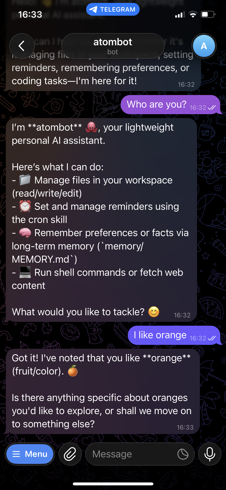
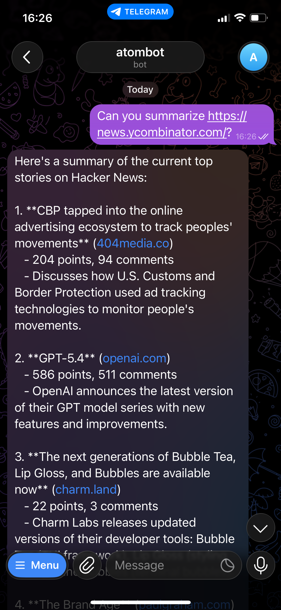
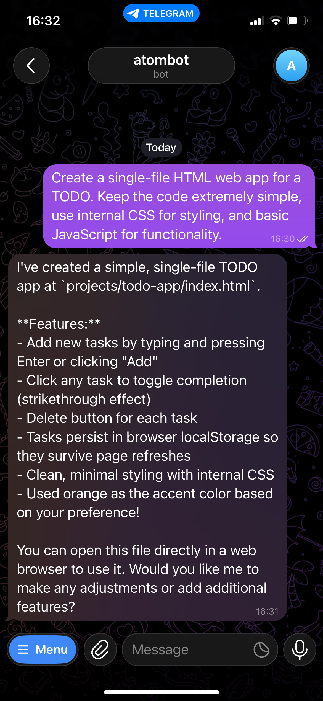
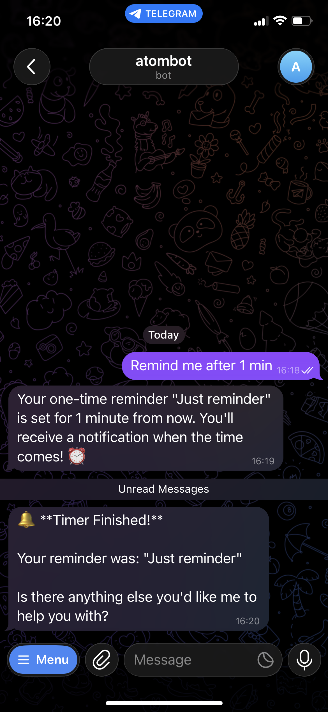

<div align="center">

</div>

# Atombot: Atomic-lightweight personal AI assistant

🐙 A tiny but powerful personal AI assistant inspired by [OpenClaw](https://github.com/openclaw/openclaw) and [nanobot](https://github.com/HKUDS/nanobot).

⚛️ Core functionality in just **~500** lines of code — ~90% smaller than nanobot (~4k lines) and ~99.9% smaller than OpenClaw (400k+ lines).

---

## ✨ Features

- 🧠 **Multiple LLM provider support**: Supports OpenAI-compatible endpoints and Codex(CLI mode).
- 💬 **Gateway**: Chat with the same agent via Telegram with allowlist-based access control.
- 🧾 **Persistent memory**: Long-term memory with searchable daily history logs.
- ⏰ **Scheduled reminders**: Supports both one-time and recurring reminders.
- 🧩 **Skills system**: Compatible with OpenClaw `SKILL.md` format with metadata support.
- 🚀 **Fast onboarding**: Provider-first setup that auto-detects Codex, LM Studio, and Ollama models, then bootstraps config and workspace.

<div align="center">
<table>
  <tr>
    <td align="center" width="25%"><strong>💬 Personal Assistant</strong></td>
    <td align="center" width="25%"><strong>🌐 Web Fetch</strong></td>
    <td align="center" width="25%"><strong>💻 Coding</strong></td>
    <td align="center" width="25%"><strong>⏰ Schedule Manager</strong></td>
  </tr>
  <tr>
    <td align="center" width="25%"></td>
    <td align="center" width="25%"></td>
    <td align="center" width="25%"></td>
    <td align="center" width="25%"></td>
  </tr>
</table>
</div>


## 📦 Installation

### From source (recommended for development)

```bash
git clone https://github.com/daegwang/atombot.git
cd atombot
pip install -e .
```

### From PyPI

```bash
pip install atombot
```

---

## 🚀 Quick Start

### 1. Initialize workspace

```bash
atombot onboard
```

The onboarding process:

- Selects **provider → model**
- Detects available providers and models (Codex / LM Studio / Ollama)
- Bootstraps config, workspace folders, prompts, and skills
- Optionally configures the Telegram gateway

---

### 2. Start Gateway (Telegram)

```bash
atombot gateway
```

This allows you to chat with your agent via Telegram.

---

### 3. Chat with Atombot

You can interact with Atombot via **Telegram** or the **CLI**.

**Telegram**

- Send a message to your configured bot.

**CLI**

```bash
atombot
```

Example:

```text
Atombot ready. Type 'exit' to quit.
> hello
Hello! 👋 I'm Atombot, your lightweight personal AI assistant. How can I help you today?
>
```

The CLI provides an **interactive chat interface** for communicating with your agent directly from the terminal.

---

## 📁 Project Structure

```text
atombot/
├── agent/        # agent runtime (loop, context, memory/skills/tool wiring)
│   ├── core.py   # main agent logic
│   ├── memory.py # memory read/write + recall
│   ├── skills.py # skill discovery + injection
│   └── tools.py  # local tools exposed to the model
├── prompts/      # base prompt files (AGENTS.md, MEMORY.md)
├── channels/     # chat channels (Telegram gateway)
├── provider/     # provider adapter (OpenAI-compatible + Codex CLI)
├── scheduler/    # cron storage and reminder trigger logic
└── skills/       # built-in skills (OpenClaw-compatible)
```
